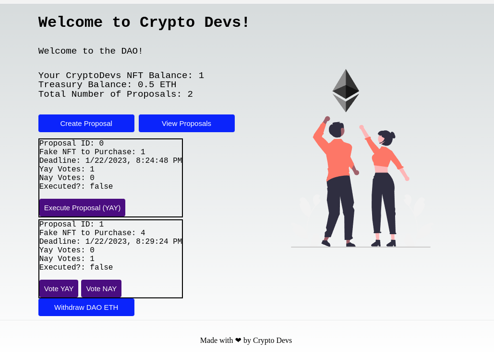

# CryptoDevsDAO - A DAO for Crypto Developers
A DAO for holders of CryptoDevs NFTs. From the ETH that was gained through an ICO, a DAO Treasury has been built up. 
CryptoDevs NFT holders can create and vote on proposals to use that ETH for purchasing other NFTs from an NFT marketplace, and speculate on price.
This app was built for the Sophomore track at LearnWeb3DAO.

This version's smart contracts have been deployed to the Goerli testnet. You can check out the deployed testnet app here: https://crypto-devs-dao-beige.vercel.app/


## How to interact with the deployed testnet app
The contract has been deployed to Ethereum Goerli for testing purposes. You can find out more about it [here](https://goerli.net/).
You need test funds to interact with the app. There are several faucets you can use to get Goerli testnet Ether for free. Here’s one example that has worked well for me in the past:
https://goerlifaucet.com/

If you’re brand new to web3: To get  started, you first need a wallet such as [Metamask](https://metamask.io/) to receive testnet funds and start interacting with the app.

### The deployed testnet contracts
FakeNFTMarketplace deployed to:  0x6593e132fB531e55f2bb698E59d5119174d6d249
CryptoDevsDAO deployed to:  0x2393d2d56488887A5F110f1c7B47530138c53811


## Installing / Getting started with the project

To install the Whitelist-Dapp, you will need to install the necessary dependencies for both the “backend” (= the blockchain part) and the frontend. Once all of the dependencies are installed and you're done editing, you can deploy the whitelist smart contract to the Ethereum (test) network and deploy the frontend to a hosting service of your choice, e.g. [Vercel](https://vercel.com/).


### 1.) Fork and clone this repository to your local machine
[Fork](https://docs.github.com/en/get-started/quickstart/fork-a-repo) this repo, then clone it to your local machine:
``` shell
git clone https://github.com/YOUR-USERNAME/CryptoDevsDAO.git
```

### 2.) Blockchain Part
Run the following commands in your CLI:
``` shell
cd CryptoDevsDAO/blockchain-pt
npm init --yes
npm install --save-dev hardhat
npx hardhat
npm install dotenv
```
Create an endpoint on [QuickNode](https://www.quicknode.com/), or any other provider of your choice, and copy the HTTP-URL.
Create a .env file and follow the structure of the [.env-example file](blockchain-pt/.env-example) to add your QuickNode URL and your private key. DO NOT upload this file to GitHub! It is already included in .gitignore but better double-check. 🙂

Once you’re done editing, run:
``` shell
npx hardhat compile 
npx hardhat run scripts/deploy.js --network goerli 
```

### 3.) The Frontend Part
The frontend is built with Next.js. You need to have [Node.js](https://nodejs.org/) installed.

Run the following commands to set-up your project and start the development server:
``` shell
cd frontend
rm package-lock.json
npm install
npm run dev
```
You should now be able to open the frontend in your browser on `localhost:3000`.


**Possible errors & fixes**

This project is built with node ^18. If you get an error message, you might have to update Node.js. To check your Node version, run:
``` shell
node -v
```
If you find a yarn-lock.json file, this might cause problems with installing npm in your project. Remove it and install npm again, then start your development server:
``` shell
rm yarn-lock.json
npm install
npm run dev
```

Once you’re done with the above, run:
``` shell
npm install web3modal
npm install ethers
```
<!-- Add NFT infos here, plus add them above: need to add old NFT collection contract data. Plus, deploy both the FakeNFTMarketplace & de DAO -->
Open constants.js and change the value of the `CRYPTODEVS_DAO_CONTRACT_ADDRESS` variable to the address of the contract you deployed via hardhat earlier.
Then change the value of the `abi` variable to your own ABI array. You can find it here: `blockchain-pt/artifacts/contracts/CryptoDevsDAO.sol/CryptoDevsDAO.json


## How to Contribute
Contributions are always welcome! Please check the [Code of Conduct](https://github.com/Sunkio/.github/CODE_OF_CONDUCT.md) .

## License
This project is licensed under the [MIT License](./License.md).

## Support
If you have any questions or need help getting started, please open an issue in the repository or contact me on Twitter: @tanja_codes